# qpv-json2video — Documentation

Complete JSON schema reference and detailed API documentation.

> 📦 **Install:** `yarn add qpv-json2video`
>
> 🚀 **Quick Start & Examples:** See [README.md](../README.md)

---

## Rendering Pipeline

```mermaid
flowchart LR
    A["📄 JSON Config"] --> B["🔍 Parse & Validate"]
    B --> C["📥 Download Assets"]
    C --> D["🎨 Render Frames"]
    D --> E["🎬 Encode Video"]
    E --> F["🔊 Mix Audio"]
    F --> G["📦 Output MP4"]
```

## Config Hierarchy

---

## 📚 Documentation Index

### Schema

| Doc                                     | Description                              |
| --------------------------------------- | ---------------------------------------- |
| [Getting Started](./getting-started.md) | Installation, Quick Start, API reference |
| [Schema](./schema.md)                   | VideoConfig, Track, Scene structure      |
| [Transitions](./transitions.md)         | 11 scene transition types                |
| [Animations](./animations.md)           | 17 animation types                       |
| [Audio](./audio.md)                     | Audio mixing, fade, loop, trim           |

### Element Types

| Doc                                | Description                                                    |
| ---------------------------------- | -------------------------------------------------------------- |
| [Text](./elements/text.md)         | Text, Google Fonts, stroke, glow, gradient, richText, counter  |
| [Image](./elements/image.md)       | Image display, fit modes, Ken Burns effect                     |
| [Video](./elements/video.md)       | Video, speed, chroma key, crop, freeze, reverse, speed ramping |
| [Shape](./elements/shape.md)       | Rectangle, circle, ellipse, line                               |
| [Caption](./elements/caption.md)   | SRT subtitles, word highlight, word-by-word display            |
| [SVG](./elements/svg.md)           | SVG rendering (inline or URL), fill color override             |
| [Waveform](./elements/waveform.md) | Audio waveform visualization (bars, line, mirror, circle)      |

### Effects & Styling

| Doc                                         | Description                  |
| ------------------------------------------- | ---------------------------- |
| [Shadow](./effects/shadow.md)               | Drop shadow on any element   |
| [Filters](./effects/filters.md)             | CSS-style visual filters     |
| [Blend Modes](./effects/blend-modes.md)     | 12 compositing blend modes   |
| [Gradient](./effects/gradient.md)           | Linear/radial gradient fill  |
| [Glow](./effects/glow.md)                   | Neon glow effect (text)      |
| [Vignette](./effects/vignette.md)           | Darkened edges effect        |
| [Color Overlay](./effects/color-overlay.md) | Semi-transparent color layer |
| [Mask](./effects/mask.md)                   | Shape and text masks         |

---

## Element Types Overview

## Scene Compositing Order

