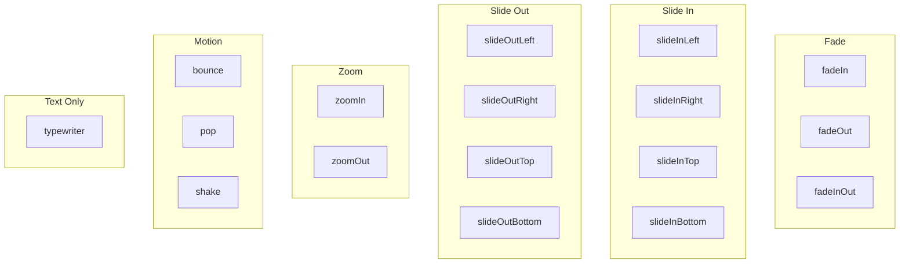

# Animations

Element-level animations applied via the `animation` property.

## Config

| Field             | Type            | Default | Description             |
| ----------------- | --------------- | ------- | ----------------------- |
| `type`            | `AnimationType` |         | Animation type          |
| `fadeInDuration`  | `number`        | `0.5`   | Fade/enter duration (s) |
| `fadeOutDuration` | `number`        | `0.5`   | Fade/exit duration (s)  |

## Animation Types



| Category   | Types                                                            | Description                               |
| ---------- | ---------------------------------------------------------------- | ----------------------------------------- |
| **Fade**   | `fadeIn`, `fadeOut`, `fadeInOut`                                 | Opacity animation                         |
| **Slide**  | `slideInLeft`, `slideInRight`, `slideInTop`, `slideInBottom`     | Element slides in from edge               |
|            | `slideOutLeft`, `slideOutRight`, `slideOutTop`, `slideOutBottom` | Element slides out to edge                |
| **Zoom**   | `zoomIn`, `zoomOut`                                              | Scale up/down animation                   |
| **Motion** | `bounce`, `pop`, `shake`                                         | Playful motion effects                    |
| **Text**   | `typewriter`                                                     | Character-by-character reveal (text only) |

## Examples

```json
{ "animation": { "type": "slideInBottom", "fadeInDuration": 0.8 } }
```

```json
{
  "animation": {
    "type": "fadeInOut",
    "fadeInDuration": 1.0,
    "fadeOutDuration": 0.5
  }
}
```

```json
{ "animation": { "type": "typewriter", "fadeInDuration": 2.0 } }
```

```json
{ "animation": { "type": "pop", "fadeInDuration": 0.6 } }
```
