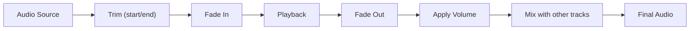

# Audio

Audio configuration for scenes. Supports a single audio config or an **array** for multi-track mixing (e.g. background music + sound effects).

## Config

| Field       | Type      | Default      | Description                               |
| ----------- | --------- | ------------ | ----------------------------------------- |
| `url`       | `string`  | **required** | Audio URL or local path                   |
| `volume`    | `number`  | `1`          | Volume multiplier                         |
| `loop`      | `boolean` | `false`      | Loop audio                                |
| `start`     | `number`  | `0`          | Start offset within scene (seconds)       |
| `duration`  | `number`  |              | Playback duration (seconds)               |
| `trimStart` | `number`  | `0`          | Trim: skip first N seconds in source file |
| `trimEnd`   | `number`  |              | Trim: stop at N seconds in source file    |
| `fadeIn`    | `number`  | `0`          | Fade in duration (seconds)                |
| `fadeOut`   | `number`  | `0`          | Fade out duration (seconds)               |

## Audio Flow



## Single Audio

```json
{
  "duration": 30,
  "audio": {
    "url": "https://example.com/bgm.mp3",
    "volume": 0.3,
    "loop": true,
    "fadeIn": 2.0,
    "fadeOut": 3.0
  }
}
```

## Multiple Audio Tracks (Mix)

```json
{
  "duration": 10,
  "audio": [
    { "url": "https://example.com/bgm.mp3", "volume": 0.2, "loop": true },
    { "url": "https://example.com/sfx.mp3", "volume": 0.8, "start": 2 }
  ]
}
```

## Trim Example

```json
{
  "audio": {
    "url": "https://example.com/song.mp3",
    "trimStart": 10,
    "trimEnd": 60,
    "volume": 0.3,
    "fadeIn": 2,
    "fadeOut": 3
  }
}
```

> This plays the audio from 10s to 60s in the source file, with 2s fade in and 3s fade out.
