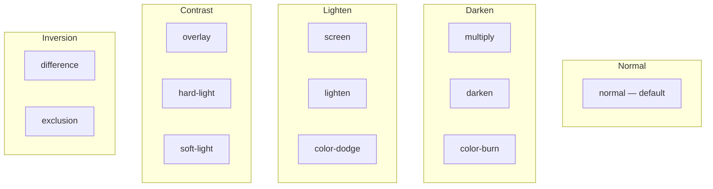

# Blend Modes

Control how an element composites onto the canvas using `blendMode`.

## Usage

```json
{ "blendMode": "screen" }
```

## Available Modes

| Value         | Description                        |
| ------------- | ---------------------------------- |
| `normal`      | Default compositing (source-over)  |
| `multiply`    | Darkens — colors multiply together |
| `screen`      | Lightens — inverse multiply        |
| `overlay`     | Combines multiply and screen       |
| `darken`      | Keeps darker color                 |
| `lighten`     | Keeps lighter color                |
| `color-dodge` | Brightens to reflect source        |
| `color-burn`  | Darkens to reflect source          |
| `hard-light`  | Like overlay but based on source   |
| `soft-light`  | Softer version of hard-light       |
| `difference`  | Absolute difference between colors |
| `exclusion`   | Like difference but lower contrast |

## Categories



## Examples

**Overlay text on image:**

```json
{
  "type": "text",
  "text": "OVERLAY",
  "blendMode": "overlay",
  "color": "#FFFFFF",
  "position": "center",
  "zIndex": 2
}
```

**Light leak effect:**

```json
{
  "type": "shape",
  "width": 1080,
  "height": 1920,
  "bgColor": "rgba(255,165,0,0.3)",
  "blendMode": "screen",
  "position": "center",
  "zIndex": 10
}
```
