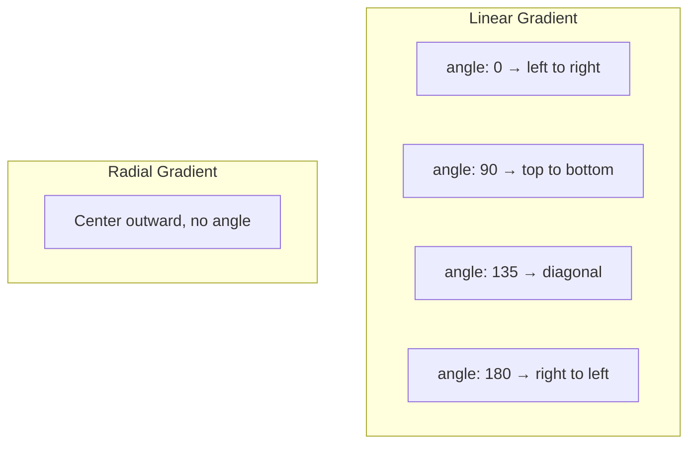

# Gradient Fill

Linear or radial gradient fill for text or shapes. Overrides solid `color` / `bgColor` when set.

## Properties

| Field    | Type                     | Default | Description                                                     |
| -------- | ------------------------ | ------- | --------------------------------------------------------------- |
| `type`   | `"linear"` \| `"radial"` |         | Gradient type                                                   |
| `colors` | `string[]`               |         | List of colors (minimum 2)                                      |
| `angle`  | `number`                 | `0`     | Angle in degrees (linear only). 0 = left→right, 90 = top→bottom |

## Gradient Direction



## Examples

**Linear gradient (horizontal):**

```json
{
  "gradient": {
    "type": "linear",
    "colors": ["#FFD700", "#FF6B6B"],
    "angle": 0
  }
}
```

**Linear gradient (vertical):**

```json
{
  "gradient": {
    "type": "linear",
    "colors": ["#0d1117", "#1a1a2e", "#0f3460"],
    "angle": 90
  }
}
```

**Radial gradient:**

```json
{
  "gradient": {
    "type": "radial",
    "colors": ["#4ECDC4", "#1a1a2e"]
  }
}
```

**Multi-color gradient on text:**

```json
{
  "type": "text",
  "text": "Rainbow",
  "gradient": {
    "type": "linear",
    "colors": ["#FF6B6B", "#FFD700", "#4ECDC4", "#45B7D1", "#a855f7"],
    "angle": 0
  }
}
```

## Where Gradients Work

| Element | Field        | Description               |
| ------- | ------------ | ------------------------- |
| Text    | `gradient`   | Gradient fill on text     |
| Shape   | `gradient`   | Gradient fill on shape    |
| Scene   | `bgGradient` | Gradient scene background |
