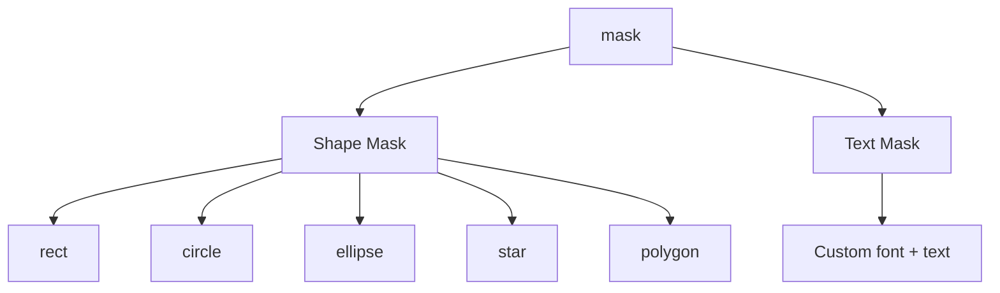

# Mask

Apply a mask to clip the element's visible area. Only the area inside the mask is rendered. Supports shape masks and text masks.

## Mask Types



---

## Shape Mask

Clip element to a shape boundary. Available shapes: `rect`, `circle`, `ellipse`, `star`, `polygon`.

### Properties

| Field          | Type      | Default      | Description                                            |
| -------------- | --------- | ------------ | ------------------------------------------------------ |
| `type`         | `string`  | **required** | `"shape"`                                              |
| `shape`        | `string`  | **required** | `"rect"` `"circle"` `"ellipse"` `"star"` `"polygon"`   |
| `radius`       | `number`  |              | Radius (px) — for circle, star, polygon                |
| `width`        | `number`  |              | Width (px) — for rect, ellipse                         |
| `height`       | `number`  |              | Height (px) — for rect, ellipse                        |
| `borderRadius` | `number`  |              | Corner radius (px) — for rect only                     |
| `points`       | `number`  | `5`          | Number of star points — for star only                  |
| `innerRadius`  | `number`  | `0.4`        | Inner radius ratio (0–1) — for star. 0=sharp, 1=circle |
| `numSides`     | `number`  | `6`          | Number of sides — for polygon only                     |
| `offsetX`      | `number`  | `0`          | Offset X from element center (px)                      |
| `offsetY`      | `number`  | `0`          | Offset Y from element center (px)                      |
| `invert`       | `boolean` | `false`      | Invert mask (show outside shape instead of inside)     |

### Examples

**Circle mask:**

```json
{
  "mask": {
    "type": "shape",
    "shape": "circle",
    "radius": 200
  }
}
```

**Rounded rect mask:**

```json
{
  "mask": {
    "type": "shape",
    "shape": "rect",
    "width": 400,
    "height": 300,
    "borderRadius": 20
  }
}
```

**Star mask:**

```json
{
  "mask": {
    "type": "shape",
    "shape": "star",
    "radius": 150,
    "points": 5,
    "innerRadius": 0.4
  }
}
```

**Hexagon mask (polygon):**

```json
{
  "mask": {
    "type": "shape",
    "shape": "polygon",
    "radius": 200,
    "numSides": 6
  }
}
```

**Inverted circle mask (show outside only):**

```json
{
  "mask": {
    "type": "shape",
    "shape": "circle",
    "radius": 150,
    "invert": true
  }
}
```

---

## Text Mask

Clip element to the shape of text characters — the element is only visible through the text.

### Properties

| Field           | Type               | Default        | Description                              |
| --------------- | ------------------ | -------------- | ---------------------------------------- |
| `type`          | `string`           | **required**   | `"text"`                                 |
| `text`          | `string`           | **required**   | Mask text content                        |
| `fontSize`      | `number`           | **required**   | Font size (px)                           |
| `fontFamily`    | `string`           | `"sans-serif"` | Font name (Google Fonts auto-downloaded) |
| `fontWeight`    | `string \| number` | `"bold"`       | Font weight                              |
| `textAlign`     | `string`           | `"center"`     | `"left"` `"center"` `"right"`            |
| `offsetX`       | `number`           | `0`            | Offset X from element center (px)        |
| `offsetY`       | `number`           | `0`            | Offset Y from element center (px)        |
| `invert`        | `boolean`          | `false`        | Invert mask (show outside text)          |
| `letterSpacing` | `number`           | `0`            | Letter spacing (px)                      |
| `strokeWidth`   | `number`           | `0`            | Stroke width for thicker text mask (px)  |

### Examples

**Text mask on image:**

```json
{
  "type": "image",
  "url": "https://example.com/landscape.jpg",
  "width": 1080,
  "height": 1920,
  "fit": "cover",
  "position": "center",
  "zIndex": 1,
  "mask": {
    "type": "text",
    "text": "NATURE",
    "fontSize": 300,
    "fontFamily": "Bebas Neue",
    "fontWeight": "bold",
    "letterSpacing": 10
  }
}
```

**Text mask on video:**

```json
{
  "type": "video",
  "url": "https://example.com/waves.mp4",
  "width": 1080,
  "height": 1920,
  "fit": "cover",
  "position": "center",
  "zIndex": 1,
  "mask": {
    "type": "text",
    "text": "OCEAN",
    "fontSize": 250,
    "fontFamily": "Orbitron",
    "strokeWidth": 5
  }
}
```

**Inverted text mask:**

```json
{
  "mask": {
    "type": "text",
    "text": "HELLO",
    "fontSize": 200,
    "fontWeight": "bold",
    "invert": true
  }
}
```
