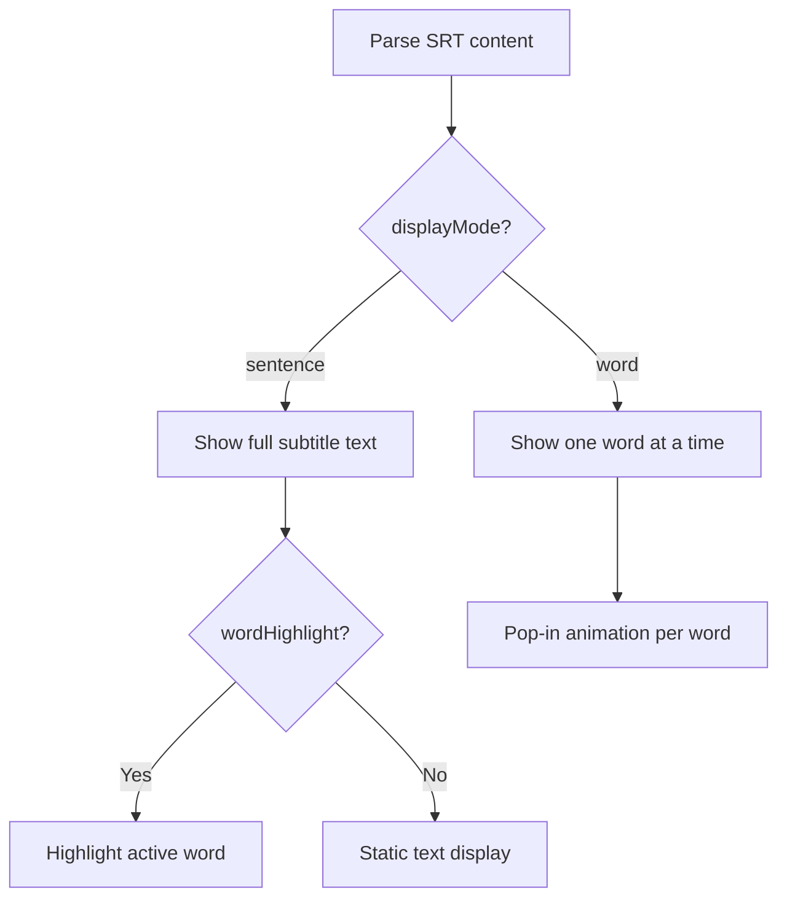

# Caption Element

SRT subtitle rendering with word-level karaoke highlighting and CapCut-style word-by-word display.

## Example

```json
{
  "type": "caption",
  "srtContent": "1\n00:00:00,000 --> 00:00:03,000\nHello world!\n\n2\n00:00:03,500 --> 00:00:06,000\nThis is a caption.",
  "fontFamily": "Exo 2",
  "fontSize": 38,
  "color": "#FFFFFF",
  "strokeColor": "#000000",
  "strokeWidth": 4,
  "backgroundColor": "rgba(0,0,0,0.6)",
  "maxWidth": "85%",
  "lineHeight": 1.5,
  "textAlign": "center",
  "borderRadius": 12,
  "position": "bottom-center",
  "zIndex": 10,
  "offsetY": -80
}
```

## Properties

| Field             | Type     | Default        | Description                             |
| ----------------- | -------- | -------------- | --------------------------------------- |
| `srtContent`      | `string` | **required**   | SRT subtitle content                    |
| `fontFamily`      | `string` | `"sans-serif"` | Font (auto Google Fonts)                |
| `fontSize`        | `number` | `52`           | Font size (px)                          |
| `color`           | `string` | `"#FFFFFF"`    | Text color                              |
| `strokeColor`     | `string` | `"#000000"`    | Outline color                           |
| `strokeWidth`     | `number` | `4`            | Outline thickness (px)                  |
| `backgroundColor` | `string` |                | Caption box background                  |
| `maxWidth`        | `string` | `"90%"`        | Max width                               |
| `lineHeight`      | `number` | `1.3`          | Line height multiplier                  |
| `textAlign`       | `string` | `"left"`       | `"left"` `"center"` `"right"`           |
| `displayMode`     | `string` | `"sentence"`   | `"sentence"` or `"word"` (CapCut-style) |

## Display Modes



| Display Mode | Description                                   |
| ------------ | --------------------------------------------- |
| `sentence`   | Show full subtitle text (default)             |
| `word`       | Show one word at a time with pop-in animation |

---

## Word-level Highlight (Karaoke)

Enable `wordHighlight: true` to highlight each word based on timing:

```json
{
  "type": "caption",
  "srtContent": "1\n00:00:00,000 --> 00:00:03,000\nHello beautiful world",
  "wordHighlight": true,
  "highlightStyle": "color",
  "highlightColor": "#FFD700",
  "fontSize": 52,
  "position": "bottom-center",
  "zIndex": 10
}
```

Word timing is auto-distributed proportionally by character count.

| Field              | Type                                     | Default                 | Description                                     |
| ------------------ | ---------------------------------------- | ----------------------- | ----------------------------------------------- |
| `wordHighlight`    | `boolean`                                | `false`                 | Enable word highlight                           |
| `highlightColor`   | `string`                                 | `"#FFD700"`             | Active word color                               |
| `highlightBgColor` | `string`                                 | `"rgba(255,215,0,0.3)"` | Active word background (for `background` style) |
| `highlightStyle`   | `"color"` \| `"background"` \| `"scale"` | `"color"`               | Highlight effect type                           |
| `highlightScale`   | `number`                                 | `1.15`                  | Scale factor (for `scale` style)                |

### Highlight Styles

| Style        | Effect                                    |
| ------------ | ----------------------------------------- |
| `color`      | Change text color (default)               |
| `background` | Add background behind word + change color |
| `scale`      | Scale up active word + change color       |

---

## Word-by-word Display (CapCut style)

Set `displayMode: "word"` to show one word at a time with a pop-in animation:

```json
{
  "type": "caption",
  "srtContent": "1\n00:00:00,000 --> 00:00:03,000\nHello beautiful world",
  "displayMode": "word",
  "highlightColor": "#FFD700",
  "fontSize": 64,
  "position": "center",
  "zIndex": 10
}
```

Each word appears individually with a smooth scale pop-in effect (ease-out-back). Word timing is auto-distributed proportionally by character count.
