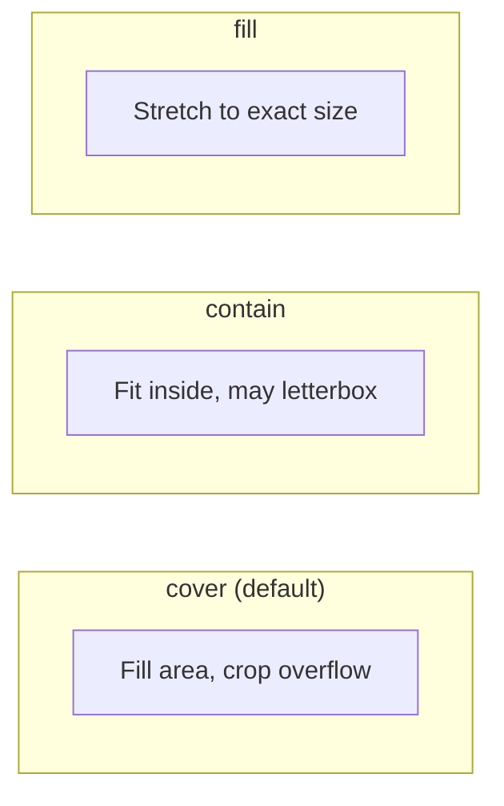

# Image Element

Display images with positioning, fit modes, and styling.

## Example

```json
{
  "type": "image",
  "url": "https://example.com/photo.jpg",
  "width": 400,
  "height": 400,
  "fit": "cover",
  "position": "top-right",
  "zIndex": 1,
  "opacity": 0.5,
  "borderRadius": 50,
  "shadow": {
    "color": "rgba(0,0,0,0.6)",
    "blur": 30,
    "offsetX": 0,
    "offsetY": 15
  }
}
```

## Properties

| Field      | Type             | Default      | Description                    |
| ---------- | ---------------- | ------------ | ------------------------------ |
| `url`      | `string`         | **required** | Image URL or local path        |
| `width`    | `number`         | **required** | Display width (px)             |
| `height`   | `number`         | **required** | Display height (px)            |
| `fit`      | `string`         | `"cover"`    | `"cover"` `"contain"` `"fill"` |
| `kenBurns` | `KenBurnsConfig` |              | Ken Burns pan & zoom effect    |

## Fit Modes



| Mode      | Description                                |
| --------- | ------------------------------------------ |
| `cover`   | Fill the area, cropping overflow (default) |
| `contain` | Fit inside the area, may have empty space  |
| `fill`    | Stretch to exact width × height            |

## Supported Sources

| Format        | Example                              |
| ------------- | ------------------------------------ |
| HTTPS         | `https://example.com/photo.jpg`      |
| HTTP          | `http://example.com/image.png`       |
| File protocol | `file:///Users/me/assets/logo.png`   |
| Relative path | `./assets/logo.png`                  |
| Absolute path | `/Users/me/project/assets/photo.jpg` |

## More Examples

**Logo with shadow:**

```json
{
  "type": "image",
  "url": "./assets/logo.png",
  "width": 100,
  "height": 100,
  "position": "top-right",
  "zIndex": 5,
  "offsetX": -24,
  "offsetY": 24,
  "borderRadius": 50,
  "shadow": {
    "color": "rgba(0,0,0,0.7)",
    "blur": 12,
    "offsetX": 0,
    "offsetY": 4
  }
}
```

**Full-screen background image:**

```json
{
  "type": "image",
  "url": "https://example.com/bg.jpg",
  "width": 1080,
  "height": 1920,
  "fit": "cover",
  "position": "center",
  "zIndex": 0,
  "opacity": 0.5
}
```

---

## Ken Burns Effect

Smooth continuous pan & zoom on static images, creating a cinematic camera movement.

| Field       | Type         | Default       | Description                                      |
| ----------- | ------------ | ------------- | ------------------------------------------------ |
| `startX`    | `number`     | `50`          | Start X position (% of image, 0=left, 100=right) |
| `startY`    | `number`     | `50`          | Start Y position (% of image, 0=top, 100=bottom) |
| `startZoom` | `number`     | `1.2`         | Start zoom level (1=100%, 1.5=150%)              |
| `endX`      | `number`     | `50`          | End X position (%)                               |
| `endY`      | `number`     | `50`          | End Y position (%)                               |
| `endZoom`   | `number`     | `1.0`         | End zoom level                                   |
| `easing`    | `EasingType` | `"easeInOut"` | Easing function                                  |

```json
{
  "type": "image",
  "url": "https://example.com/landscape.jpg",
  "width": 1080,
  "height": 1920,
  "fit": "cover",
  "position": "center",
  "zIndex": 0,
  "kenBurns": {
    "startX": 0,
    "startY": 0,
    "startZoom": 1.3,
    "endX": 100,
    "endY": 50,
    "endZoom": 1.0,
    "easing": "easeInOut"
  }
}
```
