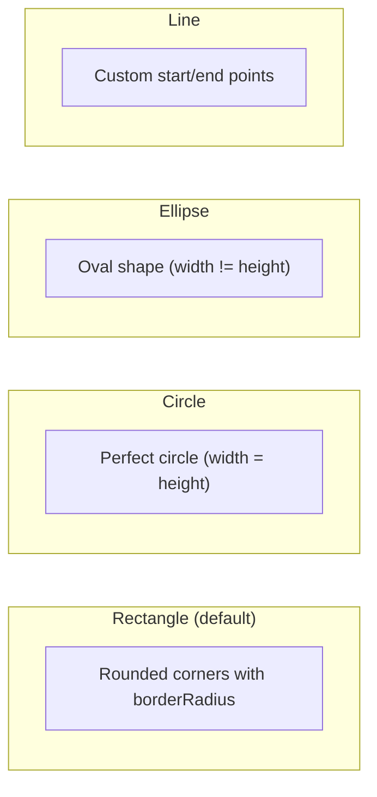

# Shape Element

Draw rectangles, circles, ellipses, and lines with fill, stroke, and gradient.

## Shape Types



## Properties

| Field         | Type             | Default       | Description                                        |
| ------------- | ---------------- | ------------- | -------------------------------------------------- |
| `shape`       | `ShapeType`      | `"rectangle"` | `"rectangle"` `"circle"` `"ellipse"` `"line"`      |
| `width`       | `number`         | **required**  | Width (px) / diameter for circle                   |
| `height`      | `number`         | **required**  | Height (px) / diameter for circle                  |
| `bgColor`     | `string`         | transparent   | Fill color (supports rgba)                         |
| `strokeColor` | `string`         |               | Border/stroke color                                |
| `strokeWidth` | `number`         | `2`           | Border thickness (px)                              |
| `gradient`    | `GradientConfig` |               | Gradient fill (overrides `bgColor`)                |
| `linePoints`  | `object`         |               | Line coordinates: `{ x1, y1, x2, y2 }` (line only) |

---

## Rectangle

```json
{
  "type": "shape",
  "width": 500,
  "height": 300,
  "bgColor": "#ff0000",
  "strokeColor": "#ffffff",
  "strokeWidth": 4,
  "borderRadius": 20,
  "position": "center",
  "zIndex": 1
}
```

## Circle

```json
{
  "type": "shape",
  "shape": "circle",
  "width": 200,
  "height": 200,
  "bgColor": "#4ECDC4",
  "strokeColor": "#FFFFFF",
  "strokeWidth": 3,
  "position": "center",
  "zIndex": 1
}
```

## Ellipse

```json
{
  "type": "shape",
  "shape": "ellipse",
  "width": 400,
  "height": 200,
  "bgColor": "rgba(255,107,107,0.5)",
  "position": "center",
  "zIndex": 1
}
```

## Line

```json
{
  "type": "shape",
  "shape": "line",
  "width": 400,
  "height": 2,
  "strokeColor": "#FFD700",
  "strokeWidth": 3,
  "linePoints": { "x1": 0, "y1": 0, "x2": 400, "y2": 0 },
  "position": "center",
  "zIndex": 1
}
```

---

## Use Cases

| Use Case            | Config                                                  |
| ------------------- | ------------------------------------------------------- |
| **Photo frame**     | `strokeColor` only → transparent inside, visible border |
| **Colored box**     | `bgColor` only → filled rectangle                       |
| **Framed box**      | both `bgColor` + `strokeColor` → filled with border     |
| **Dimming overlay** | `bgColor: "rgba(0,0,0,0.5)"` → semi-transparent overlay |
| **Gradient shape**  | `gradient` → linear/radial gradient fill                |
| **Decorative**      | `shape: "circle"` with `bgColor` or `gradient`          |
| **Separator line**  | `shape: "line"` with `linePoints`                       |

## Gradient Shape Example

```json
{
  "type": "shape",
  "width": 800,
  "height": 4,
  "gradient": {
    "type": "linear",
    "colors": ["transparent", "#4ECDC4", "transparent"],
    "angle": 0
  },
  "position": "center",
  "zIndex": 1
}
```
