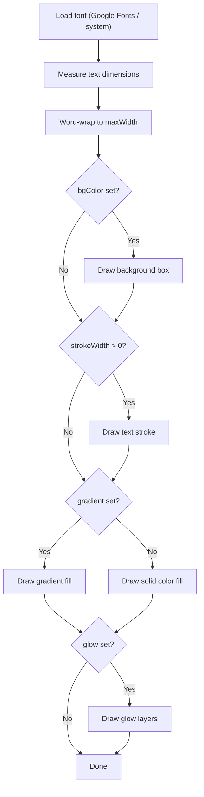

# Text Element

Render styled text with support for Google Fonts, stroke, glow, and gradient fill.

## Example

```json
{
  "type": "text",
  "text": "Hello World",
  "fontFamily": "Orbitron",
  "fontSize": 48,
  "fontWeight": "bold",
  "color": "#FFFFFF",
  "bgColor": "rgba(0,0,0,0.5)",
  "maxWidth": "80%",
  "textAlign": "center",
  "strokeColor": "#000000",
  "strokeWidth": 3,
  "lineHeight": 1.3,
  "padding": 10,
  "position": "center",
  "zIndex": 1,
  "glow": { "color": "#00FF88", "blur": 20 },
  "gradient": {
    "type": "linear",
    "colors": ["#FFD700", "#FF6B6B", "#4ECDC4"],
    "angle": 0
  }
}
```

## Properties

| Field         | Type                | Default        | Description                                                           |
| ------------- | ------------------- | -------------- | --------------------------------------------------------------------- |
| `text`        | `string`            | **required**   | Text content (supports `\n` for newlines)                             |
| `fontFamily`  | `string`            | `"sans-serif"` | Font name (Google Fonts auto-downloaded)                              |
| `fontSize`    | `number`            | `48`           | Font size (px)                                                        |
| `fontWeight`  | `string \| number`  | `400`          | `"bold"`, `700`, `"normal"`, etc.                                     |
| `color`       | `string`            | `"#FFFFFF"`    | Text color                                                            |
| `bgColor`     | `string`            |                | Background color (supports rgba)                                      |
| `maxWidth`    | `number \| string`  | 90% of canvas  | Max width. e.g. `500` or `"80%"`                                      |
| `textAlign`   | `string`            | `"left"`       | `"left"` `"center"` `"right"`                                         |
| `strokeColor` | `string`            | `"#000000"`    | Text outline color                                                    |
| `strokeWidth` | `number`            | `0`            | Outline thickness (px)                                                |
| `lineHeight`  | `number`            | `1.3`          | Line height multiplier                                                |
| `padding`     | `number`            | `10`           | Padding inside bgColor box (px)                                       |
| `glow`        | `GlowConfig`        |                | Neon glow effect (text only)                                          |
| `gradient`    | `GradientConfig`    |                | Gradient fill (overrides `color`)                                     |
| `richText`    | `RichTextSegment[]` |                | Multi-style text segments (overrides `text`)                          |
| `bgShape`     | `string`            | `"rectangle"`  | Background shape: `"rectangle"` `"pill"` `"banner"` `"speech-bubble"` |
| `counter`     | `CounterConfig`     |                | Counter/number animation (overrides `text`)                           |

> **Google Fonts:** Just set `fontFamily: "Orbitron"` — the engine auto-detects and downloads the font from Google Fonts.

## Text Rendering Flow



## Glow Effect

Neon-style glow rendered by drawing text multiple times with increasing blur.

| Field   | Type     | Default | Description                   |
| ------- | -------- | ------- | ----------------------------- |
| `color` | `string` |         | Glow color (e.g. `"#00FF88"`) |
| `blur`  | `number` | `10`    | Glow blur radius (px)         |

```json
{ "glow": { "color": "#4ECDC4", "blur": 25 } }
```

## Gradient Fill

See [Gradient](../effects/gradient.md) for full details.

```json
{
  "gradient": {
    "type": "linear",
    "colors": ["#FFD700", "#FF6B6B"],
    "angle": 90
  }
}
```

## More Examples

**Simple text:**

```json
{
  "type": "text",
  "text": "Simple text",
  "fontSize": 36,
  "color": "#FFFFFF",
  "position": "center",
  "zIndex": 1
}
```

**Text with background:**

```json
{
  "type": "text",
  "text": "With Background",
  "fontSize": 48,
  "color": "#FFFFFF",
  "bgColor": "rgba(0,0,0,0.7)",
  "padding": 20,
  "borderRadius": 12,
  "position": "bottom-center",
  "zIndex": 1
}
```

**Multiline text:**

```json
{
  "type": "text",
  "text": "Line 1\nLine 2\nLine 3",
  "fontSize": 36,
  "lineHeight": 1.5,
  "textAlign": "center",
  "maxWidth": "80%",
  "position": "center",
  "zIndex": 1
}
```

---

## Rich Text (Multi-style)

Use `richText` array to create text with different styles per segment. When set, `text` field is ignored.

```json
{
  "type": "text",
  "text": "",
  "position": "center",
  "zIndex": 1,
  "richText": [
    { "text": "SALE ", "color": "#FF0000", "fontSize": 72 },
    {
      "text": "50% OFF",
      "color": "#FFD700",
      "fontSize": 96,
      "fontWeight": "bold"
    }
  ]
}
```

**RichTextSegment properties:**

| Field         | Type               | Default      | Description                   |
| ------------- | ------------------ | ------------ | ----------------------------- |
| `text`        | `string`           | **required** | Segment text content          |
| `color`       | `string`           | inherited    | Text color                    |
| `fontSize`    | `number`           | inherited    | Font size (px)                |
| `fontWeight`  | `string \| number` | inherited    | Font weight                   |
| `fontFamily`  | `string`           | inherited    | Font family                   |
| `italic`      | `boolean`          | `false`      | Italic style                  |
| `underline`   | `boolean`          | `false`      | Underline style               |
| `bgColor`     | `string`           |              | Highlight background color    |
| `strokeColor` | `string`           |              | Stroke color for this segment |
| `strokeWidth` | `number`           |              | Stroke width for this segment |

---

## Background Shape

Control the shape of text background box via `bgShape`. Only applies when `bgColor` is set.

| Shape           | Description                             |
| --------------- | --------------------------------------- |
| `rectangle`     | Standard rectangle (default)            |
| `pill`          | Rounded ends (border-radius = height/2) |
| `banner`        | Ribbon banner with angled edges         |
| `speech-bubble` | Speech bubble with tail at bottom       |

```json
{
  "type": "text",
  "text": "BREAKING NEWS",
  "bgColor": "#FF0000",
  "bgShape": "banner",
  "color": "#FFFFFF",
  "fontSize": 48,
  "padding": 20,
  "position": "top-center",
  "zIndex": 1
}
```

---

## Counter Animation

Animated number counting effect. When `counter` is set, the `text` field is overridden with the current count value.

```json
{
  "type": "text",
  "text": "",
  "position": "center",
  "zIndex": 1,
  "fontSize": 96,
  "fontWeight": "bold",
  "color": "#FFD700",
  "counter": {
    "from": 0,
    "to": 1000,
    "duration": 2,
    "prefix": "$",
    "thousandSep": true,
    "easing": "easeOutCubic"
  }
}
```

**CounterConfig properties:**

| Field         | Type         | Default          | Description                         |
| ------------- | ------------ | ---------------- | ----------------------------------- |
| `from`        | `number`     | **required**     | Start number                        |
| `to`          | `number`     | **required**     | End number                          |
| `duration`    | `number`     | element duration | Count animation duration (seconds)  |
| `prefix`      | `string`     |                  | Prefix before number (e.g. `"$"`)   |
| `suffix`      | `string`     |                  | Suffix after number (e.g. `"%"`)    |
| `decimals`    | `number`     | `0`              | Decimal places                      |
| `thousandSep` | `boolean`    | `true`           | Use thousand separator (comma)      |
| `easing`      | `EasingType` | `"easeOutCubic"` | Easing function for count animation |
