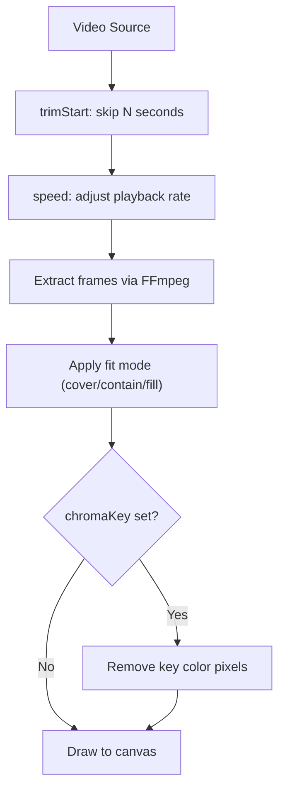

# Video Element

Embed video with playback speed control, trimming, looping, and chroma key (green screen).

## Example

```json
{
  "type": "video",
  "url": "https://example.com/bg.mp4",
  "width": 1080,
  "height": 1920,
  "fit": "cover",
  "trimStart": 2,
  "speed": 0.7,
  "loop": false,
  "volume": 0.5,
  "position": "center",
  "zIndex": 0,
  "opacity": 0.4
}
```

## Properties

| Field            | Type                | Default          | Description                                           |
| ---------------- | ------------------- | ---------------- | ----------------------------------------------------- |
| `url`            | `string`            | **required**     | Video URL or local path                               |
| `width`          | `number`            | **required**     | Display width (px)                                    |
| `height`         | `number`            | **required**     | Display height (px)                                   |
| `fit`            | `string`            | `"cover"`        | `"cover"` `"contain"` `"fill"`                        |
| `trimStart`      | `number`            | `0`              | Skip first N seconds                                  |
| `speed`          | `number`            | `1`              | Playback speed. `0.5` = slow-mo, `1.5` = fast-forward |
| `loop`           | `boolean`           | `false`          | Loop video                                            |
| `volume`         | `number`            |                  | Audio volume of video element                         |
| `chromaKey`      | `ChromaKeyConfig`   |                  | Chroma key (green screen removal)                     |
| `crop`           | `VideoCropConfig`   |                  | Crop region from source video                         |
| `reverse`        | `boolean`           | `false`          | Play video in reverse                                 |
| `freezeAt`       | `number`            |                  | Freeze at this time in source (seconds)               |
| `freezeDuration` | `number`            | element duration | Duration of freeze frame (seconds)                    |
| `speedCurve`     | `SpeedCurvePoint[]` |                  | Speed ramping (overrides `speed`)                     |

## Video Processing Flow



---

## Chroma Key (ChromaKeyConfig)

Remove a background color from video frames (green screen / blue screen effect). The keyed pixels become transparent, allowing underlying layers to show through.

```json
{
  "type": "video",
  "url": "./greenscreen.mp4",
  "width": 600,
  "height": 800,
  "position": "center",
  "zIndex": 2,
  "chromaKey": {
    "color": "#00FF00",
    "tolerance": 0.35,
    "softness": 0.1
  }
}
```

| Field       | Type     | Default | Range | Description                                 |
| ----------- | -------- | ------- | ----- | ------------------------------------------- |
| `color`     | `string` |         |       | Key color to remove (hex, e.g. `"#00FF00"`) |
| `tolerance` | `number` | `0.3`   | 0–1   | Color match range (higher = more removed)   |
| `softness`  | `number` | `0.1`   | 0–1   | Edge feathering (higher = softer edges)     |

> **Tip:** For standard green screen, use `"color": "#00FF00"` with `tolerance: 0.3–0.4`. For blue screen, use `"#0000FF"`. Adjust tolerance higher if residual color remains.

## More Examples

**Slow-motion background:**

```json
{
  "type": "video",
  "url": "https://example.com/bg.mp4",
  "width": 1080,
  "height": 1920,
  "fit": "cover",
  "speed": 0.5,
  "loop": true,
  "position": "center",
  "zIndex": 0,
  "opacity": 0.3
}
```

**Trimmed video clip:**

```json
{
  "type": "video",
  "url": "./clip.mp4",
  "width": 800,
  "height": 600,
  "trimStart": 5,
  "speed": 1.5,
  "position": "center",
  "zIndex": 1
}
```

---

## Crop (VideoCropConfig)

Crop a region from the source video.

| Field    | Type     | Description           |
| -------- | -------- | --------------------- |
| `x`      | `number` | Start X position (px) |
| `y`      | `number` | Start Y position (px) |
| `width`  | `number` | Crop width (px)       |
| `height` | `number` | Crop height (px)      |

```json
{
  "type": "video",
  "url": "./wide-shot.mp4",
  "width": 800,
  "height": 800,
  "position": "center",
  "zIndex": 1,
  "crop": { "x": 100, "y": 0, "width": 800, "height": 800 }
}
```

---

## Freeze Frame

Freeze the video at a specific time point.

```json
{
  "type": "video",
  "url": "./clip.mp4",
  "width": 1080,
  "height": 1920,
  "position": "center",
  "zIndex": 0,
  "freezeAt": 3.5,
  "freezeDuration": 2
}
```

---

## Speed Ramping (speedCurve)

Variable speed throughout the clip. When set, `speed` is ignored. The engine interpolates linearly between points.

```json
{
  "type": "video",
  "url": "./action.mp4",
  "width": 1080,
  "height": 1920,
  "position": "center",
  "zIndex": 0,
  "speedCurve": [
    { "time": 0, "speed": 1 },
    { "time": 1, "speed": 0.3 },
    { "time": 3, "speed": 2 }
  ]
}
```

| Field   | Type     | Description                                   |
| ------- | -------- | --------------------------------------------- |
| `time`  | `number` | Time point in clip (seconds)                  |
| `speed` | `number` | Speed at this point (0.5=slow-mo, 2=fast-fwd) |

---

## Reverse

Play video backwards:

```json
{
  "type": "video",
  "url": "./clip.mp4",
  "width": 800,
  "height": 600,
  "reverse": true,
  "position": "center",
  "zIndex": 1
}
```
