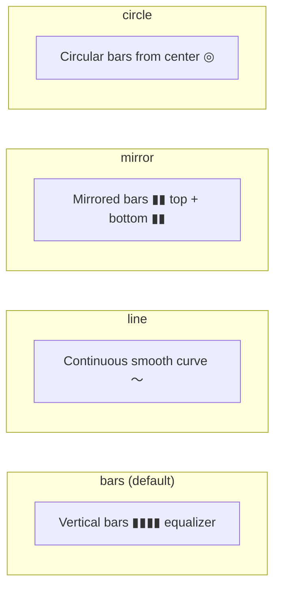

# Waveform Element

Visualize audio waveform data with animated bars, line, mirror, or circle styles. Audio data is extracted from the audio file via FFmpeg.

## Example

```json
{
  "type": "waveform",
  "audioUrl": "https://example.com/music.mp3",
  "width": 800,
  "height": 200,
  "style": "bars",
  "color": "#4ECDC4",
  "barCount": 64,
  "barGap": 2,
  "barRadius": 3,
  "sensitivity": 1.2,
  "smoothing": 0.3,
  "position": "bottom-center",
  "zIndex": 1
}
```

## Properties

| Field            | Type             | Default      | Description                                    |
| ---------------- | ---------------- | ------------ | ---------------------------------------------- |
| `audioUrl`       | `string`         | **required** | Audio file URL or local path                   |
| `width`          | `number`         | **required** | Display width (px)                             |
| `height`         | `number`         | **required** | Display height (px)                            |
| `style`          | `WaveformStyle`  | `"bars"`     | `"bars"` `"line"` `"mirror"` `"circle"`        |
| `color`          | `string`         | `"#4ECDC4"`  | Waveform color                                 |
| `secondaryColor` | `string`         |              | Fill below line (style `"line"` only)          |
| `barCount`       | `number`         | `64`         | Number of bars (2–512)                         |
| `barWidth`       | `number`         | auto         | Bar width (px), auto-calculated if not set     |
| `barGap`         | `number`         | `2`          | Gap between bars (px)                          |
| `barRadius`      | `number`         | `2`          | Bar corner radius (px)                         |
| `lineWidth`      | `number`         | `2`          | Line thickness (style `"line"` only)           |
| `sensitivity`    | `number`         | `1`          | Amplitude multiplier (>1 = louder visual)      |
| `smoothing`      | `number`         | `0.3`        | Smoothing factor (0–1, higher = smoother)      |
| `mirror`         | `boolean`        | `false`      | Mirror bars from center (use `"mirror"` style) |
| `gradient`       | `GradientConfig` |              | Gradient fill (overrides solid `color`)        |

## Waveform Styles



| Style    | Description                                   |
| -------- | --------------------------------------------- |
| `bars`   | Vertical bars growing from bottom (equalizer) |
| `line`   | Continuous smooth line waveform               |
| `mirror` | Mirrored bars from center (top + bottom)      |
| `circle` | Circular waveform with bars from center       |

## Style Examples

**Gradient equalizer bars:**

```json
{
  "type": "waveform",
  "audioUrl": "...",
  "style": "bars",
  "barCount": 48,
  "width": 800,
  "height": 200,
  "gradient": { "type": "linear", "colors": ["#00FF88", "#00BFFF"] },
  "position": "bottom-center",
  "zIndex": 1
}
```

**Smooth line with fill area:**

```json
{
  "type": "waveform",
  "audioUrl": "...",
  "style": "line",
  "color": "#FF6B6B",
  "secondaryColor": "rgba(255,107,107,0.1)",
  "lineWidth": 3,
  "smoothing": 0.5,
  "width": 800,
  "height": 200,
  "position": "bottom-center",
  "zIndex": 1
}
```

**Circular spectrum:**

```json
{
  "type": "waveform",
  "audioUrl": "...",
  "style": "circle",
  "barCount": 80,
  "width": 400,
  "height": 400,
  "gradient": { "type": "linear", "colors": ["#a855f7", "#ec4899"] },
  "position": "center",
  "zIndex": 1
}
```
