# JSON Schema

## VideoConfig (root)

| Field    | Type      | Required | Default | Description       |
| -------- | --------- | -------- | ------- | ----------------- |
| `width`  | `number`  | ✅       |         | Video width (px)  |
| `height` | `number`  | ✅       |         | Video height (px) |
| `fps`    | `number`  |          | `30`    | Frames per second |
| `tracks` | `Track[]` | ✅       |         | Array of tracks   |

> Also supports legacy format with `scenes[]` instead of `tracks[]` — auto-converted to a single track.

---

## Track

| Field    | Type                   | Required | Default   | Description                                       |
| -------- | ---------------------- | -------- | --------- | ------------------------------------------------- |
| `type`   | `"video"` \| `"audio"` |          | `"video"` | `video` renders visuals, `audio` mixes sound only |
| `zIndex` | `number`               |          | `0`       | Higher zIndex draws on top                        |
| `start`  | `number`               |          | `0`       | Start time on the global timeline (seconds)       |
| `scenes` | `Scene[]`              | ✅       |           | Scenes played sequentially within track           |

### Timeline

```mermaid
gantt
    title Multi-Track Timeline
    dateFormat X
    axisFormat %s sec

    section Track 0 (z:0)
    Scene 1        :t0s1, 0, 4
    Scene 2        :t0s2, 4, 8

    section Track 1 (z:1)
    Scene 1        :t1s1, 2, 5

    section Track Audio
    BGM            :ta1, 0, 8
```



> Tracks with higher `zIndex` are drawn on top. Audio tracks only mix sound — no visual rendering.

---

## Scene

| Field          | Type                                   | Required | Default     | Description                                       |
| -------------- | -------------------------------------- | -------- | ----------- | ------------------------------------------------- |
| `title`        | `string`                               |          |             | Scene title (for reference only)                  |
| `duration`     | `number`                               | ✅       |             | Duration in seconds                               |
| `bgColor`      | `string`                               |          | `"#000000"` | Background color                                  |
| `bgGradient`   | `{ colors: string[], angle?: number }` |          |             | Gradient background (overrides `bgColor` if set)  |
| `elements`     | `SceneElement[]`                       |          | `[]`        | Visual elements                                   |
| `audio`        | `AudioConfig \| AudioConfig[]`         |          |             | Scene audio (single or array for multi-track mix) |
| `transition`   | `SceneTransition`                      |          |             | Transition from previous scene                    |
| `vignette`     | `VignetteConfig`                       |          |             | Darkened edges effect                             |
| `colorOverlay` | `ColorOverlayConfig`                   |          |             | Semi-transparent color overlay                    |

**bgGradient example:**

```json
{
  "duration": 5,
  "bgGradient": { "colors": ["#0d1117", "#1a1a2e", "#0f3460"], "angle": 135 },
  "elements": []
}
```

---

## Base Element Properties

All element types share these properties:

| Field          | Type               | Default        | Description                                       |
| -------------- | ------------------ | -------------- | ------------------------------------------------- |
| `position`     | `PositionType`     | `"center"`     | Preset position                                   |
| `zIndex`       | `number`           | `0`            | Draw order within scene                           |
| `offsetX`      | `number`           | `0`            | Horizontal offset from position (px)              |
| `offsetY`      | `number`           | `0`            | Vertical offset from position (px)                |
| `opacity`      | `number`           | `1`            | Opacity (0–1)                                     |
| `scale`        | `number`           | `1`            | Scale factor (e.g. `1.5` = 150%)                  |
| `rotation`     | `number`           | `0`            | Rotation in degrees (clockwise)                   |
| `borderRadius` | `number`           |                | Corner radius (px)                                |
| `start`        | `number`           | `0`            | Start time within scene (seconds)                 |
| `duration`     | `number`           | scene duration | Display duration (seconds)                        |
| `animation`    | `ElementAnimation` |                | Preset animation effect                           |
| `keyframes`    | `Keyframe[]`       |                | Keyframe animation (overrides `animation` preset) |
| `shadow`       | `ShadowConfig`     |                | Drop shadow                                       |
| `filters`      | `FilterConfig`     |                | CSS-style visual filters                          |
| `blendMode`    | `BlendMode`        | `"normal"`     | Blend mode (compositing operation)                |
| `mask`         | `MaskConfig`       |                | Shape or text mask                                |

### Keyframe Animation

Define element state at specific time points. The engine interpolates between keyframes.

```json
{
  "keyframes": [
    { "time": 0, "opacity": 0, "scale": 0.5, "easing": "easeOutBack" },
    { "time": 0.5, "opacity": 1, "scale": 1 },
    { "time": 3, "offsetX": 200, "rotation": 45 }
  ]
}
```

| Field      | Type         | Description                                            |
| ---------- | ------------ | ------------------------------------------------------ |
| `time`     | `number`     | Time in element timeline (seconds, from element start) |
| `easing`   | `EasingType` | Easing function for transition TO this keyframe        |
| `opacity`  | `number`     | Opacity (0–1)                                          |
| `scale`    | `number`     | Scale factor                                           |
| `rotation` | `number`     | Rotation (degrees)                                     |
| `offsetX`  | `number`     | X offset from base position (px)                       |
| `offsetY`  | `number`     | Y offset from base position (px)                       |

**EasingType values:** `linear`, `easeIn`, `easeOut`, `easeInOut`, `easeInCubic`, `easeOutCubic`, `easeInOutCubic`, `easeInBack`, `easeOutBack`, `easeInOutBack`, `easeOutBounce`, `easeOutElastic`, `spring`

### PositionType

```
 top-left      top-center      top-right
    ┌──────────────┬──────────────┐
    │              │              │
    │    left       center        right
    │              │              │
    ├──────────────┼──────────────┤
    │              │              │
    │ bottom-left  bottom-center  bottom-right
    └──────────────┴──────────────┘
```
