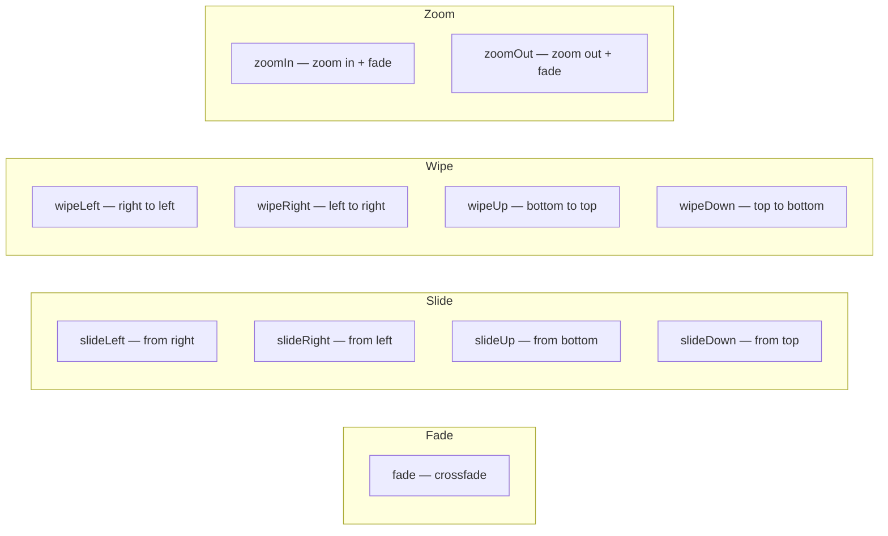

# Scene Transitions

Transition effect applied at the start of a scene, animating from the previous scene.

## Config

| Field      | Type             | Description               |
| ---------- | ---------------- | ------------------------- |
| `type`     | `TransitionType` | Transition type           |
| `duration` | `number`         | Transition duration (sec) |

## Transition Types



| Type         | Effect                                 |
| ------------ | -------------------------------------- |
| `fade`       | Standard crossfade                     |
| `slideLeft`  | New scene slides in from the right     |
| `slideRight` | New scene slides in from the left      |
| `slideUp`    | New scene slides in from the bottom    |
| `slideDown`  | New scene slides in from the top       |
| `wipeLeft`   | New scene wipes in from right to left  |
| `wipeRight`  | New scene wipes in from left to right  |
| `wipeUp`     | New scene wipes in from bottom to top  |
| `wipeDown`   | New scene wipes in from top to bottom  |
| `zoomIn`     | Previous scene zooms in and fades out  |
| `zoomOut`    | Previous scene zooms out and fades out |

## Example

```json
{ "transition": { "type": "slideLeft", "duration": 0.8 } }
```

```json
{
  "scenes": [
    { "duration": 5, "bgColor": "#1a1a2e", "elements": [] },
    {
      "duration": 5,
      "bgColor": "#0f3460",
      "transition": { "type": "fade", "duration": 1.0 },
      "elements": []
    },
    {
      "duration": 5,
      "bgColor": "#16213e",
      "transition": { "type": "wipeLeft", "duration": 0.8 },
      "elements": []
    }
  ]
}
```
